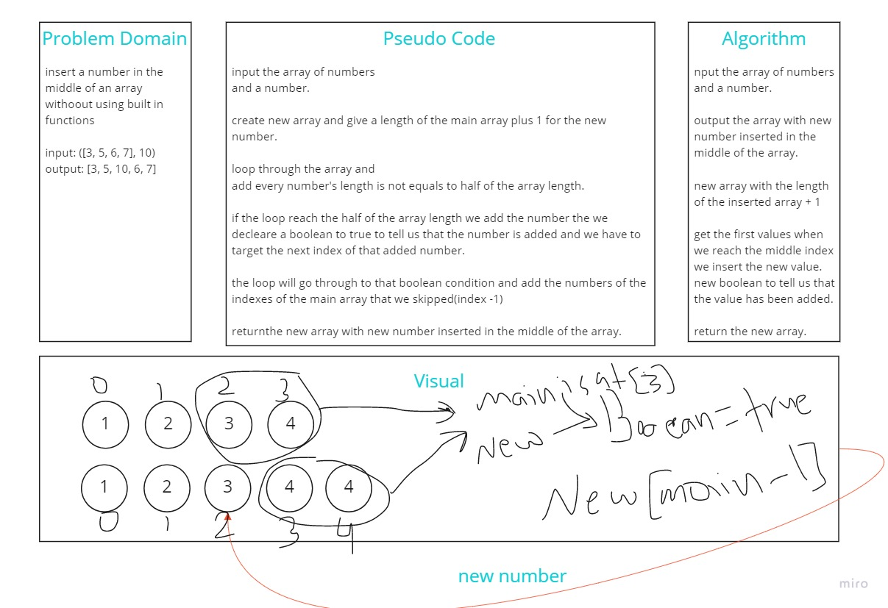

# Insert to Middle of an Array
<!-- Description of the challenge -->
having an array of numbers and a number and we need to insert the number in the middle of the array

## Whiteboard Process
<!-- Embedded whiteboard image -->

## Approach & Efficiency
<!-- What approach did you take? Discuss Why. What is the Big O space/time for this approach? -->
create new array with same length as the main one
loop through the new array and add values until we reach the middle index
add the new value with new boolean variable indicates that now we added the new value
when the boolean is true we need to get the index of main array by givin the new array the length at the current
index - 1 and add the rest of numbers