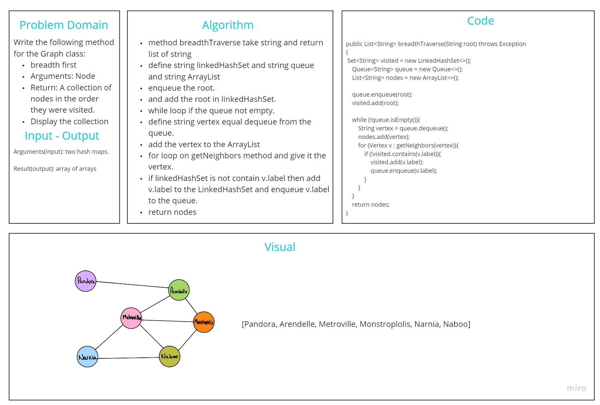

# Graphs
<!-- Short summary or background information -->
A graph data structure mainly stores connected data, for example, a network of people or a network of cities. A graph data structure typically consists of nodes or points called vertices. Each vertex is connected to another vertex using links called edges.
# WhiteBoard 

## Challenge
<!-- Description of the challenge -->
Implement a Graph data structure from scratch with its main methods
## Approach & Efficiency
<!-- What approach did you take? Why? What is the Big O space/time for this approach? -->
* add node Time: O(1), Space: O(1)
* add edge Time: O(1), Space: O(1)
* get nodes  Time: O(1), Space: O(n): n is the number of nodes
* get neighbors  Time: O(1), Space: O(m) m is the number of the neighbor nodes
* size , Time: O(n): n is the number of nodes , Space: O(1)
* breadthTraverse: Time: O(n^2) worst case where n is the number of nodes in the graph of a Complete Graphs , Space: O(n) n is the number of nodes
## API
<!-- Description of each method publicly available in your Graph -->
1. add node: only to add a new node into the graph without any connection to other nodes
2. add edge: to add a connection between two nodes with the required weight (the weight is optional)
3. get nodes: to get all the nodes in the graph as a list
4. get neighbors: to get all the connections of the required node as a list
5. size: to get the size (number) of all the nodes in the graph
6. breadth : Return: A collection of nodes in the order they were visited.