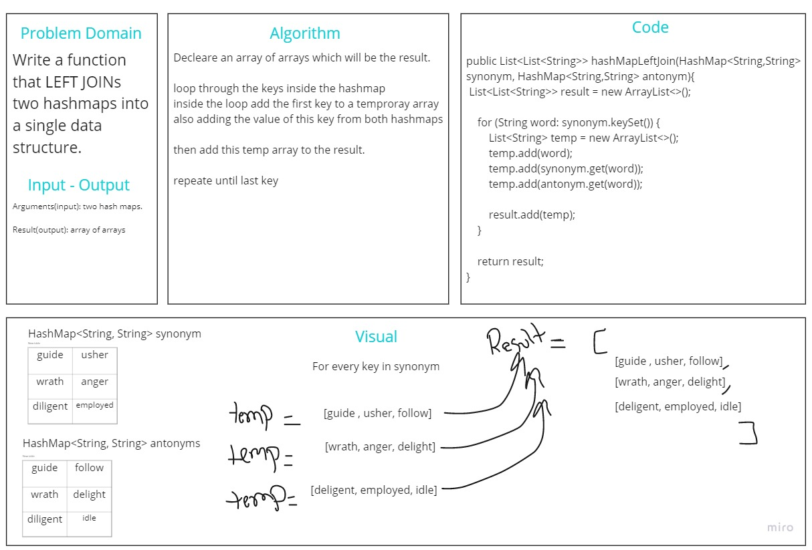

# Hashmap LEFT JOIN
<!-- Short summary or background information -->
Write a function that LEFT JOINs two hashmaps into a single data structure.
## Challenge
<!-- Description of the challenge -->
We have a set of words need to put each word's synonym and antonyms in one array using hashmap 

## Approach & Efficiency
<!-- What approach did you take? Why? What is the Big O space/time for this approach? -->
Big O of Space is O(2n)
Big O of Time is O(n)
## Solution
<!-- Embedded whiteboard image -->
