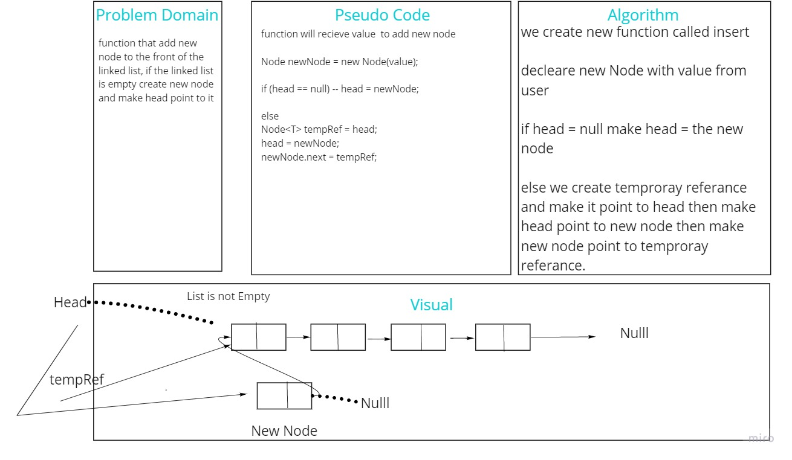
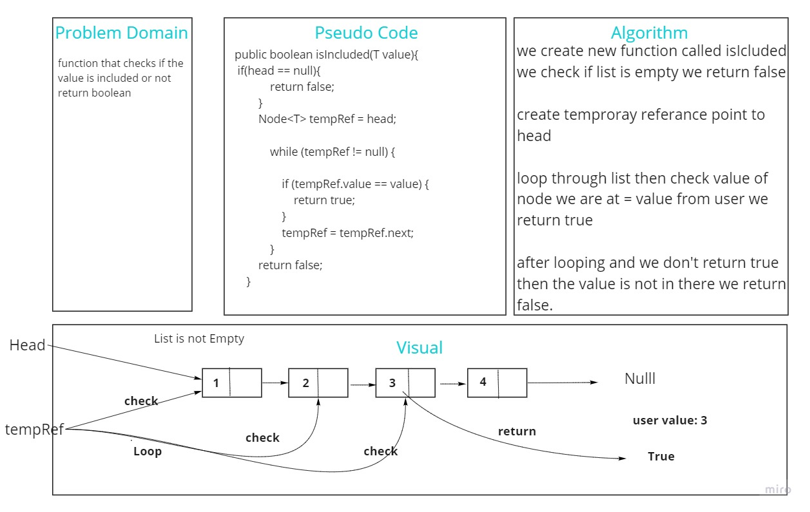
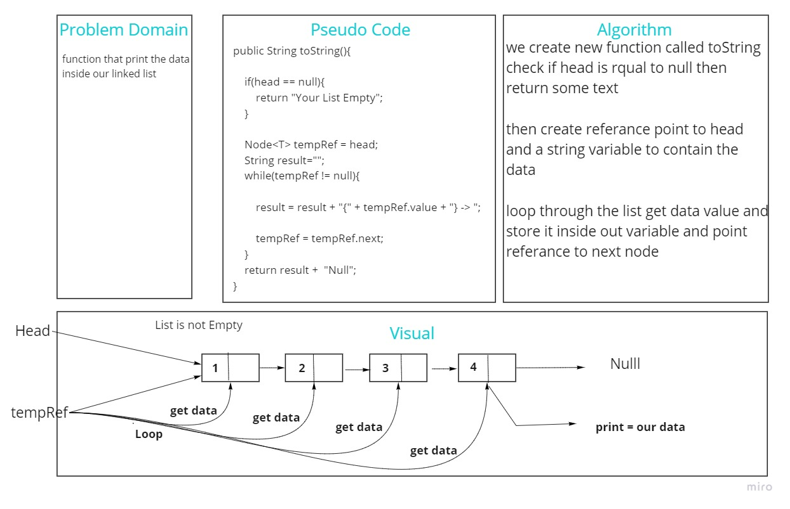
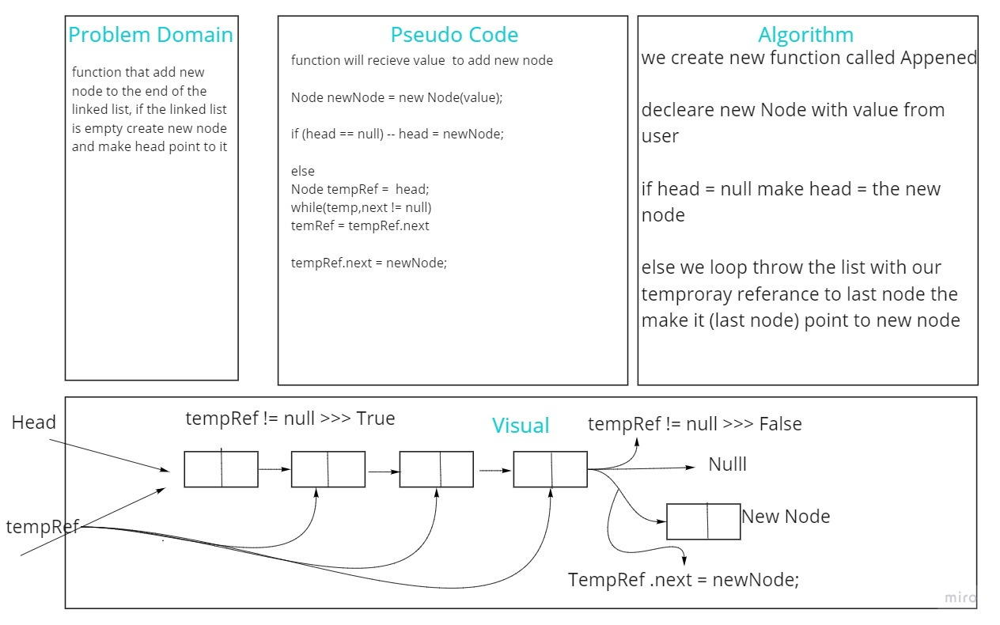
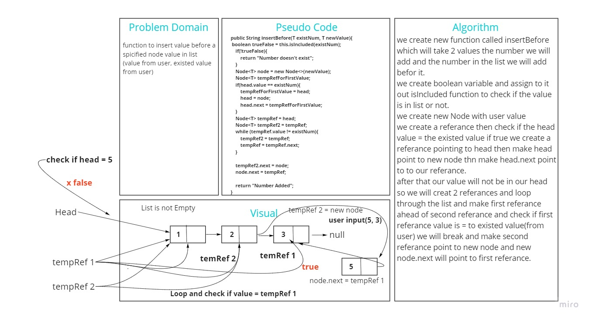
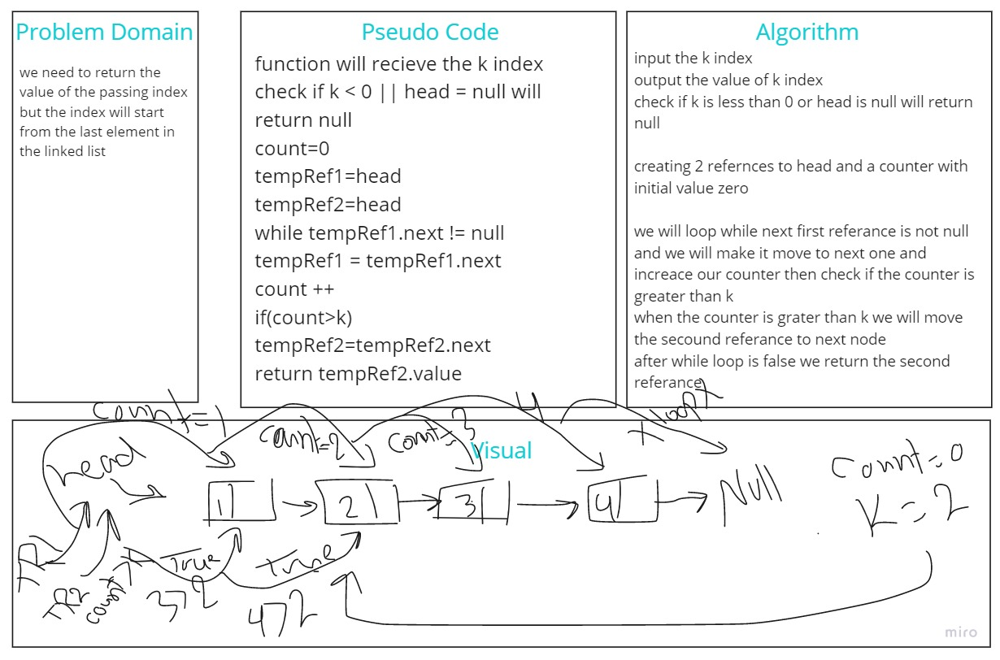
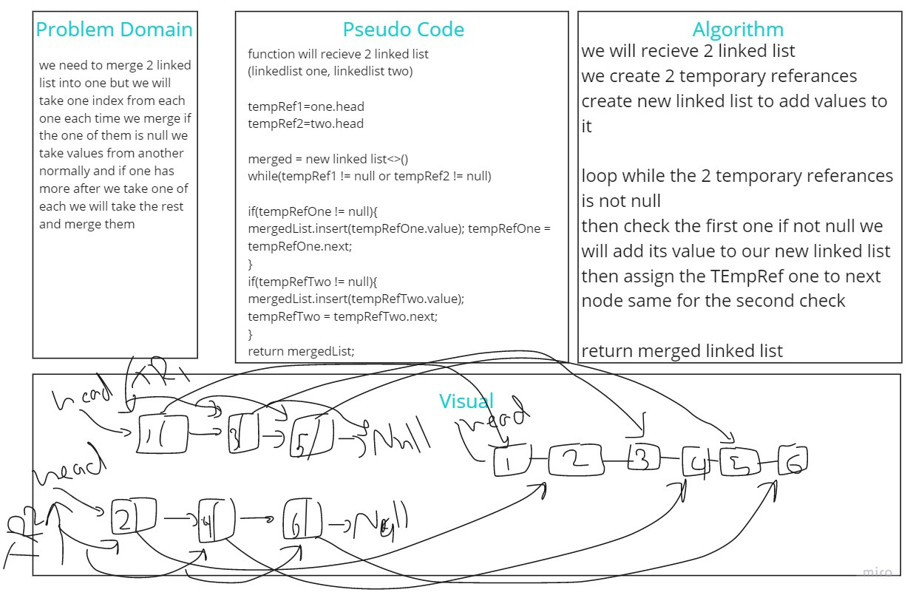

# Singly Linked List
<!-- Short summary or background information -->
linked list implementation

## Challenge
<!-- Description of the challenge -->
linked list implementation from scratch 
implement methods (insert, toString, includes)

## Approach & Efficiency
<!-- What approach did you take? Why? What is the Big O space/time for this approach? -->
OOP Approach easy to maintain
## API
<!-- Description of each method publicly available to your Linked List -->

Functions Description:

- insert: insert value at the end of the list(Accept every data type).
- toString: convert the whole list to string.
- isIncludes: will check if the value is included (Accept the value).

# Challenge Summary
<!-- Description of the challenge -->
kth from end
argument: a number, k, as a parameter.
Return the node’s value that is k places from the tail of the linked list.
You have access to the Node class and all the properties on the Linked List class as well as the methods created in previous challenges.
## Whiteboard Process
<!-- Embedded whiteboard image -->

## Approach & Efficiency
<!-- What approach did you take? Why? What is the Big O space/time for this approach? -->
bih O of space is O(1)
bih O of time is O(n)

# Challenge Summary
<!-- Description of the challenge -->
Write a function called zip lists
Arguments: 2 linked lists
Return: Linked List, zipped as noted below
Zip the two linked lists together into one so that the nodes alternate between the two lists and return a reference to the head of the zipped list.
Try and keep additional space down to O(1)
You have access to the Node class and all the properties on the Linked List class as well as the methods created in previous challenge
## Whiteboard Process
<!-- Embedded whiteboard image -->

## Approach & Efficiency
<!-- What approach did you take? Why? What is the Big O space/time for this approach? -->
bih O of space is O(1)
bih O of time is O(n)
