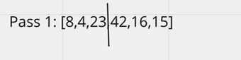
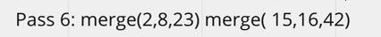
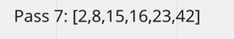

# Blog 2

## Merge Sort
* Sorting a single array by splitting it in half several times until they are sorted and can merge, and then merge it.

## Pseudocode
ALGORITHM Mergesort(arr)
DECLARE n <-- arr.length
```
if n > 1
      DECLARE mid <-- n/2
      DECLARE left <-- arr[0...mid]
      DECLARE right <-- arr[mid...n]
      // sort the left side
      Mergesort(left)
      // sort the right side
      Mergesort(right)
      // merge the sorted left and right sides together
      Merge(left, right, arr)
      
```
    

ALGORITHM Merge(left, right, arr)
DECLARE i <-- 0
DECLARE j <-- 0
DECLARE k <-- 0

```java
 public static int[] mergeSort(int [] arr){
        int length = arr.length;

        if(length > 1){
            int mid = length / 2;
            int[] left = Arrays.copyOfRange(arr, 0, mid);
            int[] right = Arrays.copyOfRange(arr, mid, arr.length);
            mergeSort(left);
            mergeSort(right);
            merge(left, right, arr);
        }
        return arr;
    }


    private static void merge(int [] left, int [] right, int [] arr){
        int leftIndex = 0;
        int rightIndex = 0;
        int originalIndex = 0;

        while (leftIndex < left.length && rightIndex < right.length) {

            if (left[leftIndex] <= (right[rightIndex])) {
                arr[originalIndex] = left[leftIndex];
                leftIndex++;
            } else {
                arr[originalIndex] = right[rightIndex];
                rightIndex++;
            }

            originalIndex++;
        }

        if (leftIndex == left.length) {

            while (rightIndex < right.length) {
                arr[originalIndex] = right[rightIndex];
                originalIndex++;
                rightIndex++;
            }

        } else {
            while (leftIndex < left.length) {
                arr[originalIndex] = left[leftIndex];
                originalIndex++;
                leftIndex++;
            }
        }

    }

```
   

## Trace
* Sample Array: [8,4,23,42,16,15]

* Pass 1
    - First will pass through the array, and then split the array in two.
      

* Pass 2
    - The array is split into two seperate arrays.
      

* Pass 3
    - The two arrays will split again.
      

* Pass 4
    - The left side will be sorted.
      

* Pass 5
    - The right side will be sorted.
      
      

* Pass 6
    - Both sides will merge once the sorting is done.
      

* Pass 7
    - Final iteration will the finished merged array.
      

## Efficiency
* Time: O(nlogn)
* Space: O(nlogn)