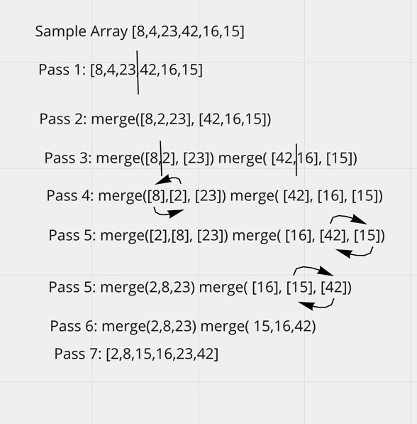
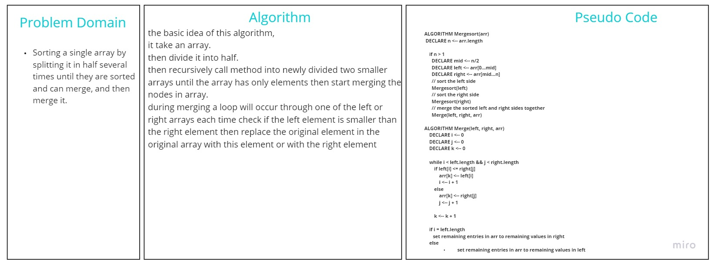

# Challenge Summary
<!-- Description of the challenge -->
Sorting a single array by splitting it in half several times until they are sorted and can merge, and then merge it.
Here are the [Code](./app/src/main/java/Merge/Sort/MergeSort.java) and [Test](./app/src/test/java/Merge/Sort/MergeSortTest.java) class.

## Whiteboard Process
<!-- Embedded whiteboard image -->

## Approach & Efficiency
<!-- What approach did you take? Why? What is the Big O space/time for this approach? -->
* Time: O(nlogn)
* Space: O(nlogn

