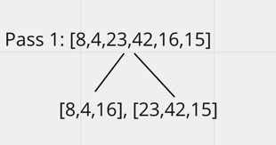
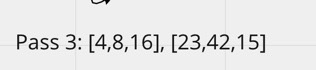
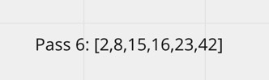

# Blog 3

## Quick Sort
* Quick Sort is a divide and conquer algorithm, and it picks an element as pivot and partitions the given array around the picked pivot.

## Psuedocode
ALGORITHM QuickSort(arr, left, right)
if left < right
// Partition the array by setting the position of the pivot value
DEFINE position <-- Partition(arr, left, right)
// Sort the left
QuickSort(arr, left, position - 1)
// Sort the right
QuickSort(arr, position + 1, right)

ALGORITHM Partition(arr, left, right)
// set a pivot value as a point of reference
DEFINE pivot <-- arr[right]
// create a variable to track the largest index of numbers lower than the defined pivot
DEFINE low <-- left - 1
for i <- left to right do
if arr[i] <= pivot
low++
Swap(arr, i, low)

     // place the value of the pivot location in the middle.
     // all numbers smaller than the pivot are on the left, larger on the right. 
     Swap(arr, right, low + 1)
    // return the pivot index point
     return low + 1

ALGORITHM Swap(arr, i, low)
DEFINE temp;
temp <-- arr[i]
arr[i] <-- arr[low]
arr[low] <-- temp

## Trace
* Sample Array: [8,4,23,42,16,15]

* Pass 1
    - First will pass through the array, and then partition the array in two.
      

* Pass 2
    - Sort the left side.
      

* Pass 3
    - Sort the right side, if needed.
      

* Pass 4
    - Swap the lowest number.
      

* Pass 5
    - Both sides will merge once the sorting is done.
      

* Pass 6
    - Final iteration will be the finished merged array.
      

## Efficiency
* Time: O(n^2)
* Space: O(n^2)