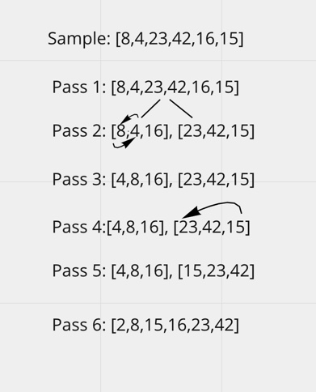

# Challenge Summary
<!-- Short summary or background information -->
* Solve the quick sort challenge, and write a blog about the challenge.
## Challenge Description
<!-- Description of the challenge -->
* Review the pseudocode below, then trace the algorithm by stepping through the process with the provided sample array. Document your explanation by creating a blog article that shows the step-by-step output after each iteration through some sort of visual.
* Once you are done with your article, code a working, tested implementation of Quick Sort based on the pseudocode provided.
```java
ALGORITHM QuickSort(arr, left, right)
        if left < right
// Partition the array by setting the position of the pivot value
        DEFINE position <-- Partition(arr, left, right)
        // Sort the left
        QuickSort(arr, left, position - 1)
        // Sort the right
        QuickSort(arr, position + 1, right)

        ALGORITHM Partition(arr, left, right)
        // set a pivot value as a point of reference
        DEFINE pivot <-- arr[right]
        // create a variable to track the largest index of numbers lower than the defined pivot
        DEFINE low <-- left - 1
        for i <- left to right do
        if arr[i] <= pivot
        low++
        Swap(arr, i, low)

        // place the value of the pivot location in the middle.
        // all numbers smaller than the pivot are on the left, larger on the right.
        Swap(arr, right, low + 1)
        // return the pivot index point
        return low + 1

        ALGORITHM Swap(arr, i, low)
        DEFINE temp;
        temp <-- arr[i]
        arr[i] <-- arr[low]
        arr[low] <-- temp
```
## Approach & Efficiency
<!-- What approach did you take? Why? What is the Big O space/time for this approach? -->
First went over the instructions, and looked over the pseudocode. Then I set up the files I needed for this challenge. I then followed the blog example to write out the blog. I drew out the whiteboard for the blog, and wrote out a simple run through of the code. The Big O for this challenge is space O(n^2), and time O(n^2) for this challenge.

## Solution
<!-- Embedded whiteboard image -->
