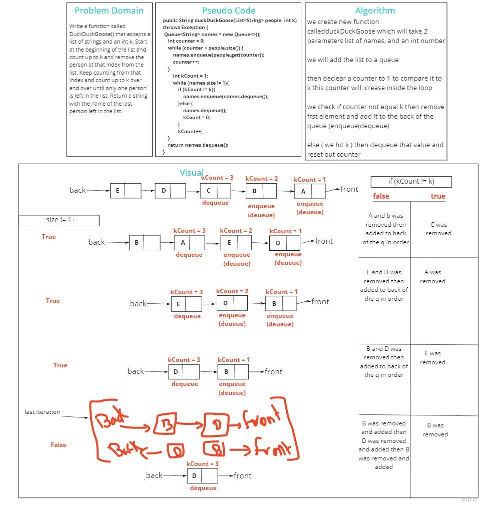

# Stacks and Queues
<!-- Short summary or background information -->
Stack is a data structure based on first in last out
Queue is a data structure based on first in first out

## Challenge
<!-- Description of the challenge -->
Implement stack and queue classes from scratch

## Approach & Efficiency
<!-- What approach did you take? Why? What is the Big O space/time for this approach? -->
for the stack and queue i only manipulate the references to add, delete nodes

## API
<!-- Description of each method publicly available to your Stack and Queue-->
**Stack Functions**
* isEmpty() ---> check if the stack is empty return true or false
* push(new Node) ---> add new node at the top
* pop() ---> delete from the top
* peek() ---> returns the top value
* toString() ---> print data

**Queue Functions**
* isEmpty() ---> check if the queue is empty return true or false
* enqueue(new Node) ---> add new node from the back of the queue
* dequeue() ---> delete from the front of the queue
* peek() ---> returns the front value
* toString() ---> print data

# Challenge Summary
<!-- Description of the challenge -->
Create a class called AnimalShelter which holds only dogs and cats.
The shelter operates using a first-in, first-out approach.
Implement the following methods:
* enqueue
Arguments: animal
animal can be either a dog or a cat object.
* dequeue
Arguments: pref
pref can be either "dog" or "cat"
* Return: either a dog or a cat, based on preference.
If pref is not "dog" or "cat" then return null.
  

## Whiteboard Process
<!-- Embedded whiteboard image -->

## Approach & Efficiency
<!-- What approach did you take? Why? What is the Big O space/time for this approach? -->
Big of space is O(n square 2)
Big of space is O(1)
## Solution
<!-- Show how to run your code, and examples of it in action -->
Go to App class you can see the PseudoQueue object initialization
and here you can see the [test](app/src/test/java/stack/Queue/AppTest.java)