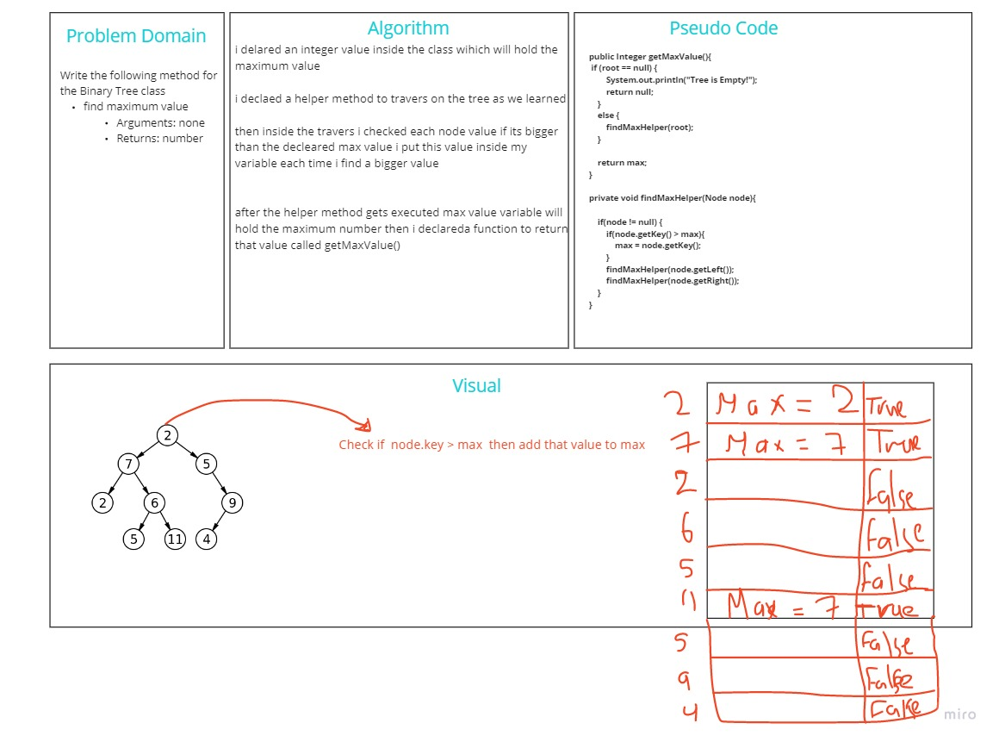

# Challenge Summary
<!-- Description of the challenge -->
Write the following method for the Binary Tree class

find maximum value
Arguments: none
Returns: number

## Whiteboard Process
<!-- Embedded whiteboard image -->

## Approach & Efficiency
<!-- What approach did you take? Why? What is the Big O space/time for this approach? -->
Big O of space is O(1)
Big O of time is O(n)
## Solution
<!-- Show how to run your code, and examples of it in action -->
go to app/src/main/java/Trees/App.java there is an example for the find max value
and here is the [test](../../../test/java/Trees/AppTest.java) for this challenge