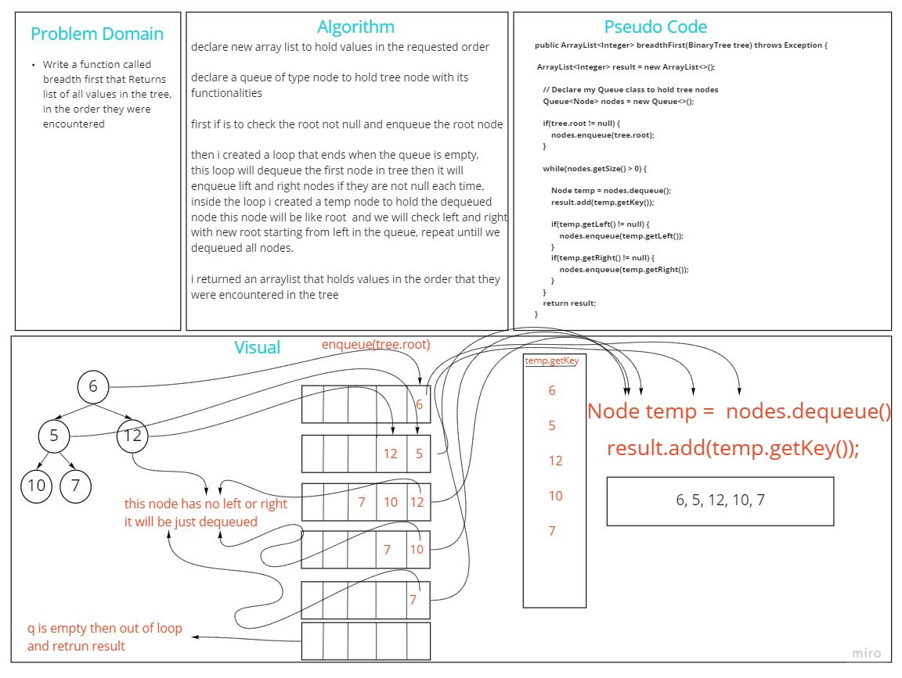

# Challenge Summary
<!-- Description of the challenge -->
**tree breadth first**
Write a function called breadth first
Arguments: tree
Return: list of all values in the tree, in the order they were encountered

## Whiteboard Process
<!-- Embedded whiteboard image -->

## Approach & Efficiency
<!-- What approach did you take? Why? What is the Big O space/time for this approach? -->
declare new array list to hold values in the requested order

declare a queue of type node to hold tree node with its functionalities

first if is to check the root not null and enqueue the root node

then I created a loop that ends when the queue is empty,
this loop will dequeue the first node in tree then it will enqueue lift and right nodes if they are not null each time,
inside the loop I created a temp node to hold the dequeued node this node will be like root and we will check left and right
with new root starting from left in the queue, repeat until we dequeued all nodes.

I returned an arraylist that holds values in the order that they were encountered in the tree

big O space is O(1)
big O time is O(n) where n is number of nodes in tree

## Solution
<!-- Show how to run your code, and examples of it in action -->

to run this code go to src/main/java/Trees/App and run the main function