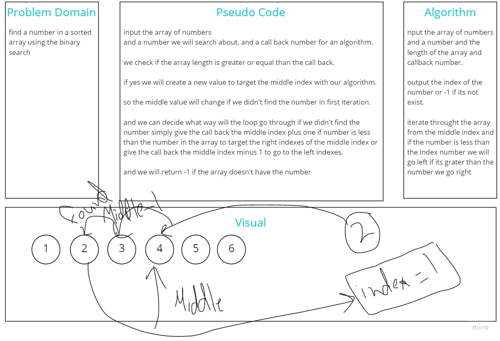

# Binary Search of Sorted Array
<!-- Description of the challenge -->
find the number in sorted array

## Whiteboard Process
<!-- Embedded whiteboard image -->

## Approach & Efficiency
<!-- What approach did you take? Discuss Why. What is the Big O space/time for this approach? -->
we check if the array length is greater or equal than the call back.

if yes we will create a new value to target the middle index with our algorithm.

so the middle value will change if we didn't find the number in first iteration.

and we can decide what way will the loop go through if we didn't find the number simply give the call back the middle index plus one if number is less than the number in the array to target the right indexes of the middle index or give the call back the middle index minus 1 to go to the left indexes.

and we will return -1 if the array doesn't have the number
