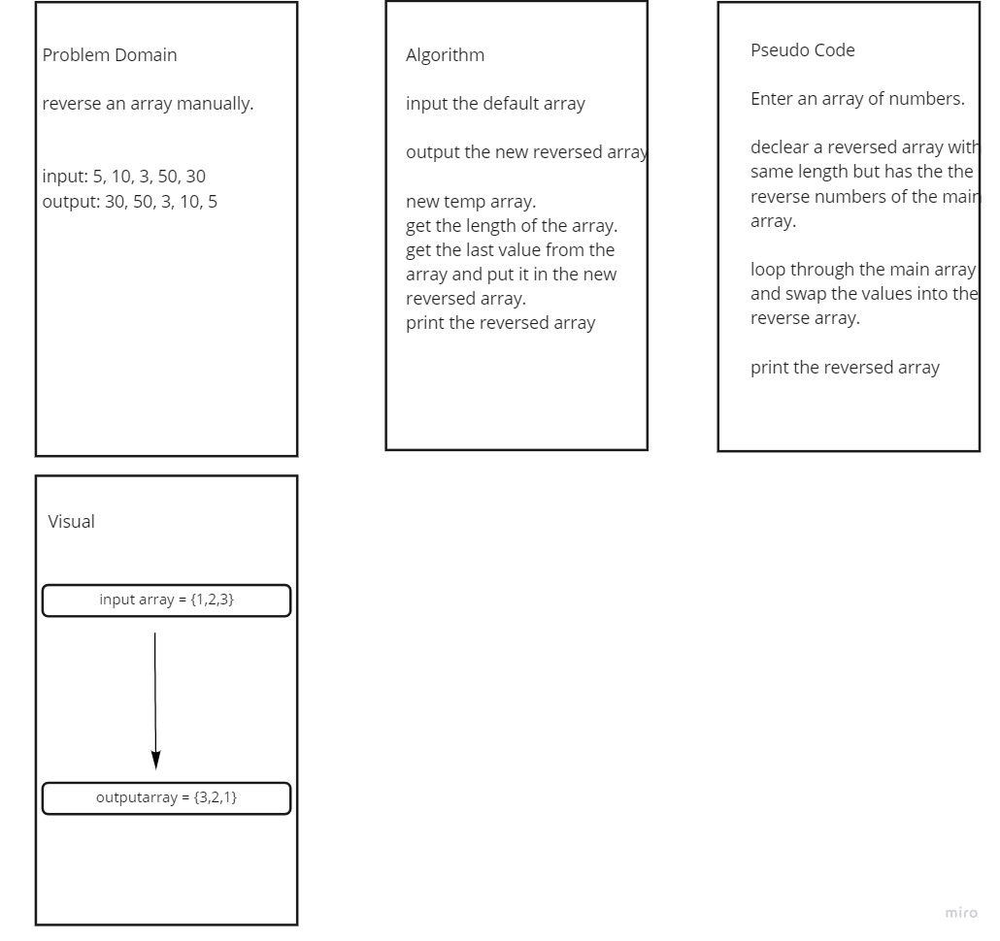

# Reverse an Array
Reverse an array without using built in function.

## Whiteboard Process

## Approach & Efficiency
<!-- What approach did you take? Discuss Why. What is the Big O space/time for this approach? -->
create temp array
loop through the main array and on same loop save each index on a temp value push this value to the temp array
throught out looping i will start the index from the length of the main array and i will decrease the index by 1 

 