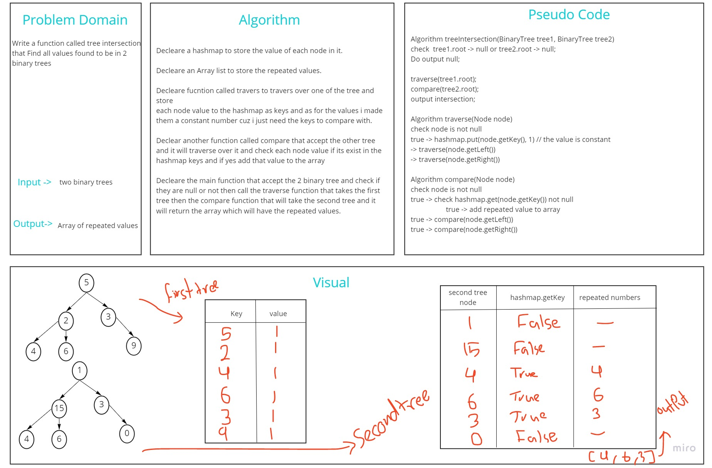

# Challenge Summary
<!-- Description of the challenge -->
Write a function called tree intersection that Finds all values found to be in 2 binary trees

## Whiteboard Process
<!-- Embedded whiteboard image -->

## Approach & Efficiency
<!-- What approach did you take? Why? What is the Big O space/time for this approach? -->
Time is O(n) where n is the number of nodes
Space is O(n) where n is the number of nodes
## Solution
<!-- Show how to run your code, and examples of it in action -->
There are two methods helpers for the main method the main method is to check if the both trees are empty, and it calls two methods and return array contains repeated values
1. the traverse helper method which will take the first tree root to traverse over the first tree and adding the node value as a key, and a constant value inside a hashmap
2. the compare helper takes the second tree root and traverse over it and when it traverse there is a check if the current node value exist in the hashmap and if true i added that value to the array