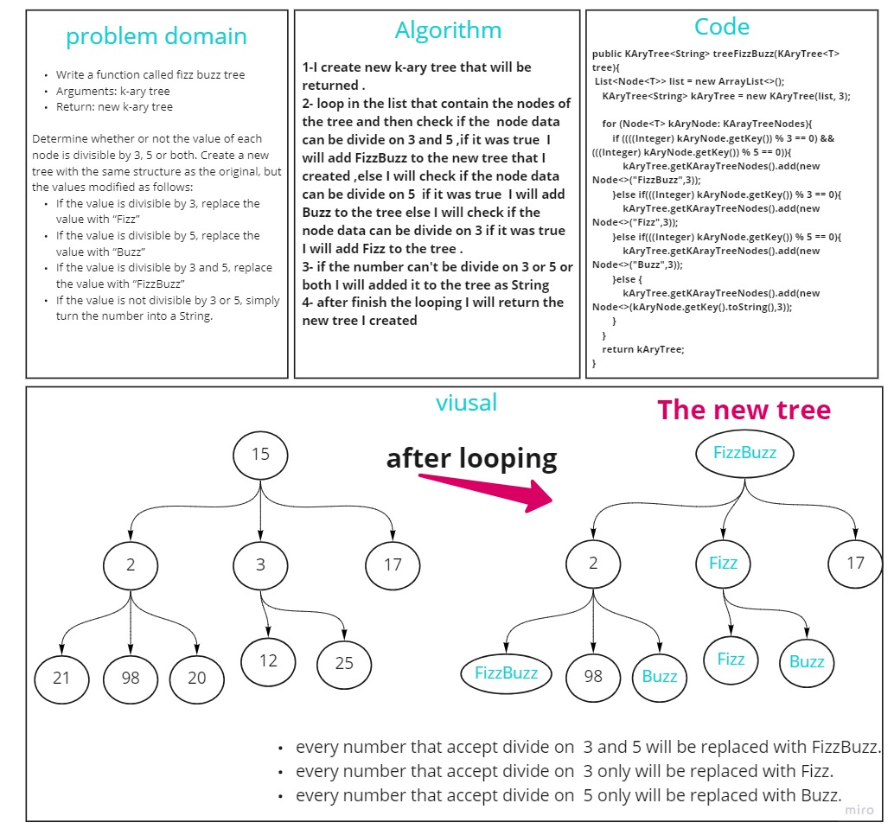

# Challenge Summary
<!-- Description of the challenge -->
Write a function called fizz buzz tree
Arguments: k-ary tree
Return: new k-ary tree
Determine whether or not the value of each node is divisible by 3, 5 or both. Create a new tree with the same structure as the original, but the values modified as follows:

If the value is divisible by 3, replace the value with “Fizz”
If the value is divisible by 5, replace the value with “Buzz”
If the value is divisible by 3 and 5, replace the value with “FizzBuzz”
If the value is not divisible by 3 or 5, simply turn the number into a String.
## Whiteboard Process
<!-- Embedded whiteboard image -->

## Approach & Efficiency
<!-- What approach did you take? Why? What is the Big O space/time for this approach? -->
Big O of Space is 
Big O of Time is
## Solution
<!-- Show how to run your code, and examples of it in action -->
go to Challenge/tree-fizz-buzz/app/src/main/java/tree/fizz/buzz/App.java and see the example k ary tree and run the main function

here is the [test](./app/src/test/java/tree/fizz/buzz/AppTest.java) 